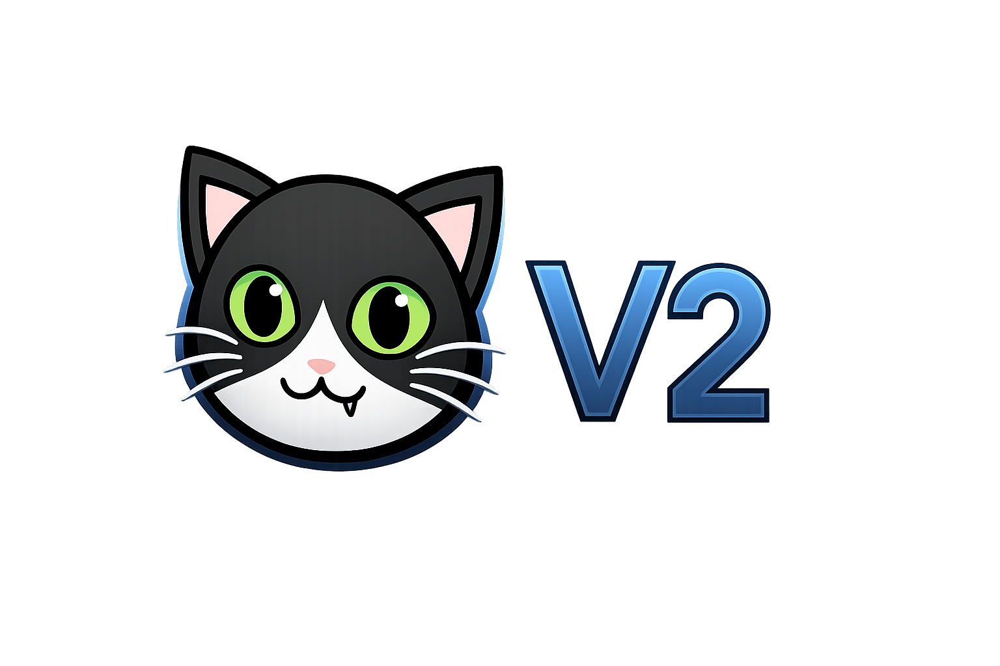

Medicat v2
 

##🧩 Présentation générale

Medicat v2 est un projet visant à proposer une alternative moderne et simplifiée à l’installation traditionnelle de Medicat USB.
Ce projet n’installe pas Medicat officiel, mais une version alternative, conçue pour offrir une expérience plus stable, plus accessible et plus sécurisée aux utilisateurs.

L’objectif est de fournir un environnement de dépannage complet, utilisable sur une clé USB bootable, sans les difficultés techniques souvent rencontrées avec Medicat original.

-------------------------------------------
##🎯 Objectif du projet
Medicat v2 a été créé pour répondre à un besoin réel :

permettre aux utilisateurs ayant rencontré des problèmes avec Medicat officiel (erreurs, lenteurs, instabilité, installation complexe, comportement. suspect)

de disposer d’un outil sain, fiable et facile à installer

sans manipulation dangereuse ou risque pour le système Windows

avec une installation automatisée, guidée et sécurisée

accessible même aux personnes peu expérimentées

L’objectif est de rendre le dépannage informatique plus simple, plus sûr, et plus accessible.

-------------------------------------------
##💡 Concept
Le concept de Medicat v2 repose sur une idée simple :

Créer automatiquement une clé USB de dépannage, sans installer Medicat officiel, mais une alternative stable et moderne, pensée pour éviter les erreurs et les risques.

Le projet combine plusieurs éléments techniques :

téléchargement automatisé

barre de progression dynamique pour voir les stat de l'installation

reprise après coupure réseau

formatage sécurisé via Ventoy

extraction automatique des fichiers

vérification de version

scripts Batch et PowerShell combinés

L’ensemble du processus est conçu pour être fiable, automatique, et sans intervention complexe.

-------------------------------------------
##🔐 Sécurité et prévention des risques
Medicat v2 intègre plusieurs mécanismes pour protéger l’utilisateur :

blocage total de l’installation sur le disque C:  
pour éviter toute destruction du système Windows

détection automatique de la clé USB  
afin d’éviter les erreurs de sélection de disque

formatage contrôlé via Ventoy  
garantissant une installation propre et stable

vérification de l’intégrité du téléchargement  
pour éviter les fichiers corrompus

reprise automatique après coupure réseau  
pour éviter les téléchargements incomplets

Ces protections permettent d’utiliser l’installeur sans risque, même pour les utilisateurs débutants.

-------------------------------------------
##🛠️ Pourquoi cette alternative a été créée
Cette version alternative de Medicat a été conçue pour :

offrir une solution plus stable que Medicat officiel

éviter les erreurs fréquentes rencontrées par les utilisateurs

proposer un outil sain, sans fichiers manquants ou instables

simplifier la création d’une clé USB de dépannage

moderniser un outil apprécié mais parfois difficile à installer

permettre une installation automatisée, sans manipulation dangereuse

rendre le dépannage informatique accessible à tous

L’objectif est de fournir une alternative fiable pour les utilisateurs qui souhaitent un outil de secours simple, propre et sécurisé.

-------------------------------------------
##🚀 Conclusion
Medicat v2 est une alternative moderne à l’installation classique de Medicat USB.
Il propose une expérience plus intuitive, plus stable et plus accessible, tout en respectant les bonnes pratiques de sécurité.

Ce projet a pour ambition de devenir un outil utile pour tous ceux qui souhaitent réparer, diagnostiquer ou restaurer un système Windows, sans connaissances techniques avancées et sans les risques associés aux installations manuelles.
